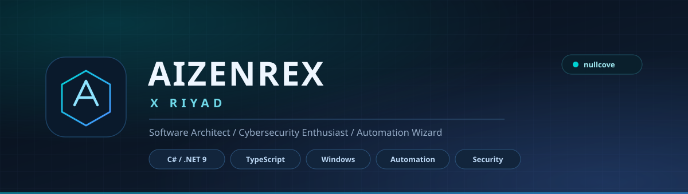

<picture>
  <source media="(prefers-color-scheme: light)" srcset="assets/banner-light.svg">
  <source media="(prefers-color-scheme: dark)" srcset="assets/banner.svg">
  
</picture>

 

 

  

 

[**Projects**](#what-i-build) &nbsp;&nbsp;|&nbsp;&nbsp; [**Stack**](#stack) &nbsp;&nbsp;|&nbsp;&nbsp; [**Stats**](#stats) &nbsp;&nbsp;|&nbsp;&nbsp; [**Contact**](#contact)

---

## Who I am

I build **tools that do one thing properly**.

On Windows that means native applications in **C# and .NET** - search engines that read the NTFS Master File Table directly, folder switchers that journal every write so a crash can never lose your data. On the web it means **full-stack TypeScript**: React and Next.js front ends over Express and PostgreSQL, wired end to end.

I care about the unglamorous parts: what happens when the power cuts out mid-write, what a failure looks like at 2am, whether an uninstall leaves anything behind. Software should be honest about its own limits.

> Also known as **nullcove** - the name I keep for the security and automation side of the work.

---

## What I build

<table>
<tr><td width="50%" valign="top">

### AizenRex Search-man

An ultra-fast native Windows file search engine. Reads the NTFS **Master File Table** directly instead of crawling the filesystem, so results are effectively instant across millions of files.

`C#` `NET 9` `WebView2` `MFT / USN Journal`

[Repository](https://github.com/aizenrexx/AizenRex-Search-man)

</td><td width="50%" valign="top">

### AizenRex Steam Switcher

Keeps two Steam installations side by side and swaps which one is live - with a journal before every write, a config backup, and a one-click repair if a switch is ever interrupted.

`C#` `NET 9` `WPF` `Inno Setup`

[Repository](https://github.com/aizenrexx/AizenRex-Steam-Switcher) &nbsp;/&nbsp; [Latest release](https://github.com/aizenrexx/AizenRex-Steam-Switcher/releases/latest)

</td></tr>
<tr><td valign="top">

### Link Haven

A full-stack bookmark manager. Collections, tags, AI-powered search and auto-tagging, a command palette, reading mode, duplicate and broken-link detection, and an analytics dashboard.

`React` `Vite` `Express 5` `PostgreSQL` `Drizzle` `Gemini`

[Repository](https://github.com/aizenrexx/link-haven)

</td><td valign="top">

### Proton Pass

A full-featured password manager clone - vaults, item types, a password and passphrase generator, a strength scorer, and a security centre that surfaces weak and reused passwords.

`React` `Vite` `Express` `PostgreSQL` `Drizzle`

[Repository](https://github.com/aizenrexx/proton-pass)

</td></tr>
<tr><td valign="top">

### Smart Notes

A notes app in the Standard Notes mould: a three-panel workspace with starring, archiving, trash, tags, full-text search, auto-save, a rich-text editor, and an AI assistant with multi-provider routing and persistent memory.

`Next.js 15` `React 19` `Express 5` `Insforge` `Tiptap`

[Repository](https://github.com/aizenrexx/smart-ins-note)

</td><td valign="top">

### Amar Hisab

A personal accounting and expense tracker, built for day-to-day use rather than a demo. Dashboard, categories, charts and a clean Bengali-first interface.

`Next.js 15` `TypeScript` `Tailwind CSS` `Recharts` `Motion`

[Repository](https://github.com/aizenrexx/ledger-knox) &nbsp;/&nbsp; [Live](https://ledger-knox.vercel.app)

</td></tr>
</table>

**Also:** [Steam AAA/AA Deals](https://github.com/aizenrexx/steam-aaa-deals) - an auto-generated tracker of AAA/AA Steam titles at 80-100% off.

---

## Stack

**Native / desktop**

  

**Web / full-stack**

  

**Tooling**

---

## Stats

 

 

<picture>
  <source media="(prefers-color-scheme: light)" srcset="https://raw.githubusercontent.com/aizenrexx/nullcove/output/github-contribution-grid-snake.svg">
  <source media="(prefers-color-scheme: dark)" srcset="https://raw.githubusercontent.com/aizenrexx/nullcove/output/github-contribution-grid-snake-dark.svg">
  
</picture>

---

## Contact

|  |  |
|:---|:---|
| **Name** | Aizenrex x Riyad |
| **Also known as** | nullcove |
| **Based in** | Dhaka, Bangladesh |
| **Focus** | Windows tooling / security / automation / full-stack |

 

[**Repositories**](https://github.com/aizenrexx?tab=repositories) &nbsp;&nbsp;|&nbsp;&nbsp; [**Steam Switcher releases**](https://github.com/aizenrexx/AizenRex-Steam-Switcher/releases/latest) &nbsp;&nbsp;|&nbsp;&nbsp; [**Search-man releases**](https://github.com/aizenrexx/AizenRex-Search-man/releases/latest)

  

<i>Build it so it survives the crash.</i>

